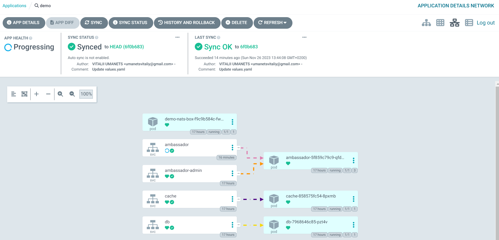
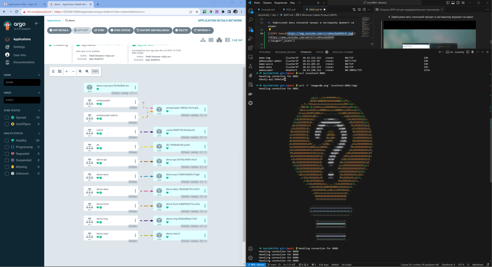

# Minimum Viable Product (MVP):

`Ціль:` Створити мінімальний функціональний продукт, який може вивести на ринок та отримати зворотний зв'язок від користувачів. В нашому випадку це демонтрація роботи застосунку `AsciiArtify`

`Зміст документації:` Документація MVP повинна включати більше деталей порівняно із PoC. Зазвичай це включає визначення функціональних вимог, дизайн інтерфейсу, технічну архітектуру, план виконання, тестовий план, план масштабування та стратегію впровадження.

1. Перевіряємо роботу застосунку AsciiArtify
- Переадресуємо порти наступною командою:
```bash
$ 

Forwarding from 127.0.0.1:8081 -> 80
Forwarding from [::1]:8081 -> 80
```
- Зробимо запит на вказаний порт та отримаємо відповідь у вигляді версії додатку:  
```bash
$ curl localhost:8081
k8sdiy-api:599e1af#       
```
- Наче все добре, але  ArgoCD з цим не згоден, швидше за все помилка в конфігарійних файлах

2. Виравлення проблеми з конфігураційними файлами
- після попередніх експериментів перевіримо мережеві налаштування нашого застосунку:
```bash
✗ k get svc -n demo
NAME               TYPE           CLUSTER-IP      EXTERNAL-IP   PORT(S)               AGE
ambassador         LoadBalancer   10.43.190.212   <pending>     80:30092/TCP          84s
```
- заглянемо в інтерфейс ArgoCD, де відразу помітимо що стан здоров'я нашого додатку `ambassador` невизначено, отже копаємо сюди.

  
- В [репозиторії з конфігураційними файлами helm](https://github.com/vit-um/go-demo-app/blob/master/helm/values.yaml) виправимо тип `api-gateway:` на `NodePort`

- За допомогою ArgoCD виявимо зміни в конфігурації та застосоємо їх до продуктивної версії нашого застосунку

- Перевіримо зміни:
```bash
✗ k get svc -n demo
NAME               TYPE           CLUSTER-IP      EXTERNAL-IP   PORT(S)         AGE
ambassador         NodePort       10.43.190.212   <none>        80:30092/TCP    84s
```

3. Перевіримо роботу застосунка після виправлення помилки
- Для цього завантажимо файл що зберігається у нас в локальному сховищі на вітдалений сервер командою:
```bash
curl -F 'image=@g.png' localhost:8081/img/
```
- Отримаємо результат прямо в консолі:  

  

4. Зафіксуємо весь описаний процес в наглядному форматі на відео:

[](https://www.youtube.com/watch?v=uGHwzDpGGE0)


